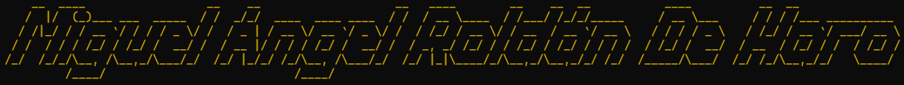

  

###

###

I am a cybersecurity student with studies in multiplatform application development

###

  
  

###

<h4 align="left">Contact me :</h4>

###

  
  
  

###

<h4 align="left">Programming languages ​​and programs :</h4>

###

  
  
  
  
  
  
  
  
  
  
  
  
  
  
  
  
  
  
  
  
  
  
  
  
  
  
  
  
  
  
  
  

###

<h4 align="left">🚀 My Approach :</h4>

###

As a cybersecurity and ethical hacking enthusiast, I like to stay up to date with the latest technologies and trends. My proactive mentality leads me to create a multitude of projects, which can be seen reflected in my profile.

###

<h4 align="left">🔐 Projects and Experiments :</h4>

###

In my free time I like to make machines on Hack the Box, which piques my curiosity in the field of ethical hacking. On the creative side, I love creating red team and forensic tools. I also focus on my personal project, Ciber Monkey. Ciber Monkey It is a toolbox written in Python and designed for pentesting (tested only in controlled environments).

###

###